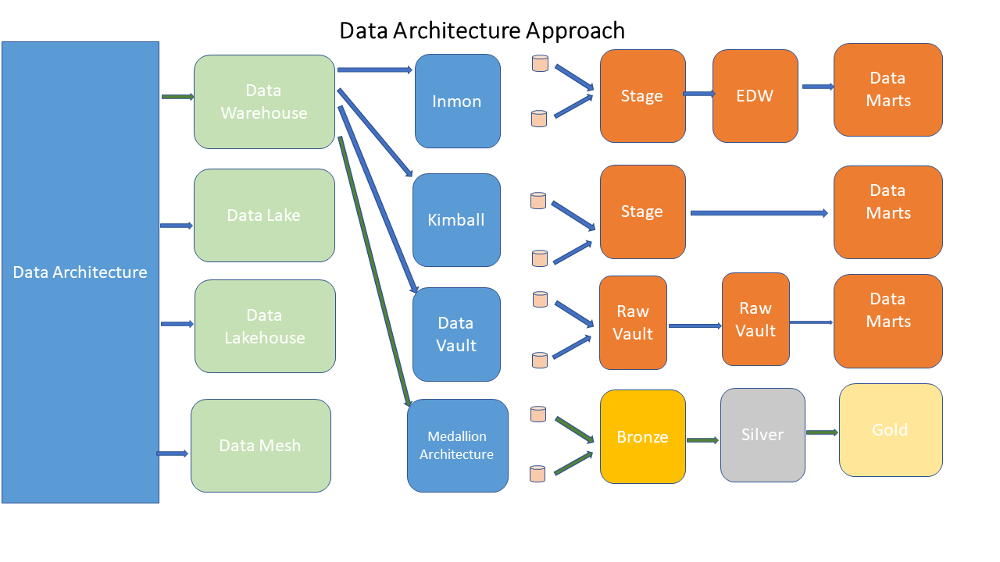

# Supply Chain Data Warehouse & Analytics for Resource Distribution (SQL Server Project)

## Project Overview

This project demonstrates an end-to-end **Data Warehouse and Analytics solution** built using SQL Server.

It models a real-world **supply chain and resource distribution system**, transforming raw transactional data into a structured analytical warehouse that supports **data-driven decision-making in logistics, demand planning, and efficiency optimization**.

The system follows a **Medallion Architecture (Bronze → Silver → Gold)** and implements a **Star Schema data model with surrogate keys, KPI analytics, and BI-ready views**.

---

## Why This Project Matters

This project demonstrates how raw operational data can be transformed into a structured analytics system that supports real-world decision-making.

It reflects real industry practices used in:
- Supply chain systems  
- E-commerce analytics  
- Humanitarian logistics platforms  

---

## Project Objectives

- Design and implement a scalable data warehouse using SQL Server  
- Clean, transform, and structure raw supply chain data  
- Build a **Star Schema (Fact & Dimension model)**  
- Implement **Surrogate Keys for optimized relational integrity**  
- Develop a **KPI Analytical Layer for business insights**  
- Create **BI-ready views for reporting tools (Power BI)**  
- Support decision-making in **resource distribution and logistics**  

---

## Data Architecture
 

[View Data Warehouse Layers](Docs/data_warehouse_layers.png)

### Data Flow

Source Data → Bronze Layer → Silver Layer → Gold Layer → Analytics & BI

Full Data Warehouse Design available on [View Data Warehouse Design](Docs/data_warehouse_design.drawio.png)

### Layer Description

- **Bronze Layer**  
  Raw ingested data from source systems with no transformations.

- **Silver Layer**  
  Cleaned and standardized data.  
  Data quality issues such as duplicates and inconsistencies are resolved.

- **Gold Layer**  
  Business-ready data modeled using a Star Schema (Fact & Dimension tables) optimized for analytics and reporting.

> Note: While the Silver layer can be queried for validation and intermediate analysis, the **Gold layer serves as the single source of truth for reporting and analytics**.

---

## Data Model (Gold Layer - Star Schema)

Full Star Schema available on `[View Star Schema](Docs/star_schema.drawio.png) 

### Fact Table

**fact_orders**
- Order_ID  
- Order_Date  
- Ship_Date  
- Ship_Mode  
- Sales  
- Quantity  
- Discount  
- Profit  
- Customer_Key (FK)  
- Product_Key (FK)  

---

### Dimension Tables

**dim_customers**
- Customer_Key (PK - Surrogate Key)  
- Customer_ID (Business Key)  
- Customer_Name  
- Region  
- Segment  

**dim_products**
- Product_Key (PK - Surrogate Key)  
- Product_ID (Business Key)  
- Product_Name  
- Category  
- Sub_Category  

---

## Data Dictionary (Summary)

> Full data dictionary available on `[View Data Dictionary](Docs/data_dictionary.md)

### fact_orders
- Sales → Revenue per transaction  
- Quantity → Number of items sold  
- Discount → Discount applied  
- Profit → Profit or loss (can be negative)  

### dim_customers
- Segment → Consumer, Corporate, Home Office  
- Region → Geographic classification  

### dim_products
- Category → High-level grouping  
- Sub_Category → Detailed product classification  

---

## Key Design Features

- Star Schema architecture for analytical efficiency  
- Surrogate Keys for improved scalability and join performance  
- Separation of Fact and Dimension tables  
- Separation of storage (Silver) and analytics (Gold)  
- Fully structured Gold layer for analytics  
- Reusable BI-ready views  

---

## Performance Optimization

Indexes implemented on Fact table:

- Customer_Key  
- Product_Key  

These indexes improve:
- Join performance between Fact and Dimensions  
- KPI query execution speed  
- Dashboard responsiveness  

---
## KPI Analytical Layer: Cross-Project Harmony

This section maps **Project 1 (Data Warehouse)** KPI questions to **Project 2 (Data Science Capstone)** deliverables. Every business question from the warehouse project is explicitly addressed in the analytics and ML layers below.

---

### Part A: Descriptive Analytics (Project 1 KPIs → Project 2 Views & Dashboards)

| Project 1 KPI Question | Project 2 Answer Location | Status |
|------------------------|---------------------------|--------|
| **1a. Monthly/yearly sales trends** | `gold.vw_sales_analysis` + Power BI "Monthly Sales Trend" chart | ✅ Complete |
| **1b. Regions with highest revenue** | `gold.vw_sales_analysis` + Power BI "Sales by Region" map | ✅ Complete |
| **1c. Top 10 best-selling products** | `gold.vw_sales_analysis` + Power BI "Top 10 Products" table | ✅ Complete |
| **1d. Product categories contributing most to profit** | `gold.vw_sales_analysis` + Power BI "Profit by Category" bar chart | ✅ Complete |
| **1e. Average order value by segment** | Calculated metric in `gold.vw_sales_analysis` | ✅ Complete |
| **2a. Most profitable sub-categories** | Power BI "Product Profitability" page | ✅ Complete |
| **2b. Products frequently bought together** | *ML Section 4 (Recommendation System)* | 🔄 ML Phase |
| **2c. Products with highest discount rates** | `gold.vw_sales_analysis` + filter by discount column | ✅ Complete |
| **2d. Profit margin by category** | Calculated column in `gold.vw_sales_analysis` | ✅ Complete |
| **2e. Loss leaders (negative profit)** | Power BI "Loss-making Products" filter | ✅ Complete |
| **3a. Average shipping time by ship mode** | *ML Section 5 (Shipping Mode Classification)* | 🔄 ML Phase |
| **3e. Ship mode most used by each segment** | `gold.vw_sales_analysis` crosstab query | ✅ Complete |
| **4a. Cities with most profit** | `gold.vw_sales_analysis` + city-level aggregation | ✅ Complete |
| **4b. Sales distribution across states** | Power BI "Regional Distribution" map | ✅ Complete |
| **5a. Seasonal sales patterns** | Time series decomposition (ML Section 1) | 🔄 ML Phase |
| **5b. Months with highest/lowest sales** | `gold.vw_sales_analysis` + monthly aggregation | ✅ Complete |
| **5c. Discounts by time of year** | Power BI "Discount vs Time" scatter plot | ✅ Complete |
| **Discount impact on profit** | Power BI "Discount vs Profit" scatter plot | ✅ Complete |
| **Loss-making vs profitable segments** | Power BI "Profitability Analysis" page | ✅ Complete |
| **Customer contribution to revenue** | Power BI "Customer Contribution" Pareto chart | ✅ Complete |

---

### Part B: Machine Learning Extensions (Project 2 Original Work)

| ML Task | Target Variable | Business Value | Status |
|---------|----------------|----------------|--------|
| **1. Sales Forecasting** | Sales (time series) | Predict next month's sales by category | 🔄 In Progress |
| **2. Customer Segmentation** | Cluster labels | Identify high-value customer groups | 🔄 In Progress |
| **3. Profit Prediction** | Profit (regression) | Predict order profitability, optimal discount | 🔄 In Progress |
| **4. Product Recommendation** | Product associations | "Bought together" recommendations | 🔄 Planned |
| **5. Shipping Mode Classification** | Ship Mode | Predict customer shipping preference | 🔄 Planned |
| **6. Discount Optimization** | Discount (optimal) | Maximize profit via discount tuning | 🔄 Planned |
| **7. Customer Churn Prediction** | Will order again? (binary) | Identify at-risk customers early | 🔄 Planned |

---

### Part C: Where to Find Everything

#### SQL Views (in `gold` schema)
- `vw_sales_analysis` — Primary BI dataset answering KPIs 1a, 1b, 1c, 1d, 1e, 2c, 2d, 2e, 4a, 4b, 5b

#### Power BI Dashboard Pages
| Page | Answers Project 1 KPIs |
|------|------------------------|
| Executive Overview | 1a, 1b, 1e, 5a, 5b |
| Product Performance | 1c, 1d, 2a, 2d, 2e |
| Customer Insights | 1e, 3e, customer contribution |
| Profitability Analysis | Discount impact, loss leaders |
| Geographic Analysis | 1b, 4a, 4b |

#### Jupyter Notebooks (ML Phase)
- `01_sales_forecasting.ipynb` → Answers 5a (seasonality), 1a (future trends)
- `02_customer_segmentation.ipynb` → High-value customer profiles
- `03_profit_prediction.ipynb` → Optimal discount analysis
- `04_recommendation_system.ipynb` → Answers 2b (bought together)
- `05_shipping_classification.ipynb` → Answers 3a (shipping time by mode)
- `07_churn_prediction.ipynb` → Customer retention KPIs

---

### Part D: Explicit Cross-Project Mapping Summary
1a (sales trends) → Power BI + gold.vw_sales_analysis
1b (top regions) → Power BI map + SQL aggregation
1c (top products) → Power BI table + SQL ORDER BY
1d (profit category) → Power BI bar chart
2a (sub-categories) → Power BI drill-down
2b (bought together) → ML Recommendation System (Notebook 04)
2e (loss leaders) → Power BI filter (profit < 0)
3a (shipping time) → ML Shipping Classification (Notebook 05)
5a (seasonality) → ML Sales Forecasting (Notebook 01)
Discount optimization → ML Profit Prediction (Notebook 03)

---

### Part E: Validation Checklist for Evaluators

- Every Project 1 KPI is explicitly listed above
- Each KPI has a clear Project 2 artifact (view, dashboard, or ML model)
- ML models directly extend descriptive answers into predictions
- Power BI dashboards are mapped to specific PDF sections
- SQL views support all aggregations needed for KPIs

---

**Note on Two-Project Harmony:**  
Project 1 delivered the data warehouse foundation. 
Project 2 consumes that warehouse to answer descriptive KPIs (via SQL + Power BI) and 
adds predictive value (via ML models). 
This README serves as the **single source of truth** connecting both projects.

## KPI Analytical Layer

The following business questions are answered:

### Business Performance
- Total Sales, Profit, Quantity, and Orders  
- Profit Margin analysis  

### Geographic Analysis
- Sales by Region  
- Profit by Region  

### Product Performance
- Sales by Category  
- Top 10 Products by Revenue  
- Product Profitability  

### Customer Analysis
- Sales by Customer Segment  
- Customer contribution to revenue  

### Pricing & Efficiency
- Discount impact on Profit  
- Loss-making vs profitable segments  

### Time-Based Trends
- Monthly Sales and Profit trends  

---

## Reporting Layer (Views)

**gold.vw_sales_analysis**

This view:
- Joins Fact and Dimension tables using surrogate keys  
- Provides a BI-ready dataset  
- Supports dashboards and reporting  

---

## Power BI Dashboard Design (Planned)

### Page 1: Executive Overview
- Total Sales KPI Card  
- Total Profit KPI Card  
- Profit Margin KPI Card  
- Sales by Region  
- Monthly Sales Trend  

### Page 2: Product Performance
- Top 10 Products  
- Sales by Category  
- Profit by Category  

### Page 3: Customer Insights
- Sales by Segment  
- Regional Distribution  
- Customer Contribution  

### Page 4: Profitability Analysis
- Discount vs Profit  
- Loss-making products  
- Profit distribution  

---

## Tools & Technologies

- SQL Server (T-SQL)  
- Python  
- Data Warehousing (Star Schema Design)  
- Surrogate Key Modeling  
- SQL Indexing & Optimization  
- Power BI  
- Git & GitHub  

---

## Data Engineering Process

1. Data Acquisition (Global Superstore dataset)  
2. Data Splitting (Customers, Orders, Products)  
3. Data Cleaning (Silver Layer)  
4. Data Modeling (Gold Layer)  
5. Performance Optimization (Indexing)  
6. Analytics Layer (KPI queries)  
7. Reporting Layer (Views for BI tools)  

---

## Real-World & Humanitarian Application

This project simulates real-world **supply chain and humanitarian logistics systems**, applicable to:

- Resource distribution tracking  
- Humanitarian aid delivery  
- Monitoring & Evaluation (M&E)  
- NGO and UN logistics operations  
- Public sector planning  

---

## Key Skills Demonstrated

- Data Warehouse Design & Architecture  
- ETL Pipeline Development  
- Star Schema Modeling  
- Surrogate Key Implementation  
- SQL Performance Optimization  
- KPI Development & Analytics  
- BI-Ready Data Modeling  

---

## Future Improvements

- Incremental loading (ETL automation)  
- Slowly Changing Dimensions (SCD Type 2)  
- Power BI dashboard implementation  
- Data quality monitoring  
- Cloud migration (Azure/AWS)  

---

## Project Status

Completed as a structured SQL Data Warehousing and Analytics project with ongoing enhancements for advanced analytics and BI integration.

---

## Author
Geu Kuei

Data Analyst | Data Engineer (Aspiring) | Monitoring & Evaluation (M&E) | Public Health & Education Data | 
ALX Data Engineering Fellow

## License
This project is licensed under the MIT License. You are free to use, modify, and share this project with proper attribution.
