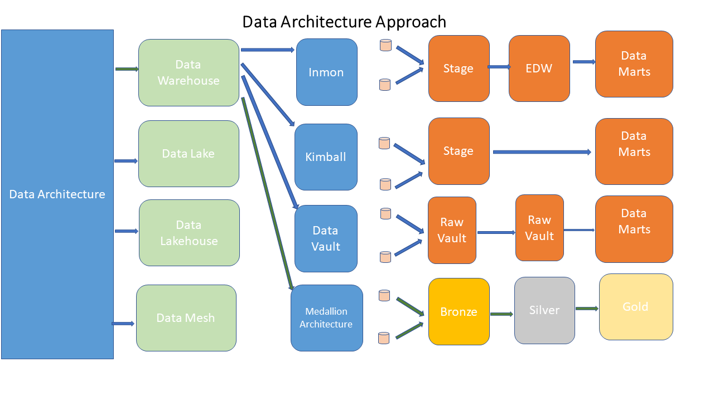
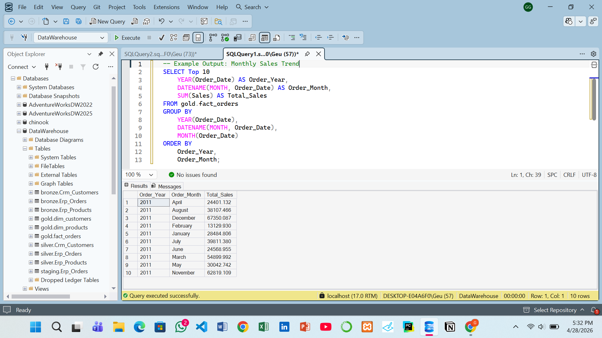
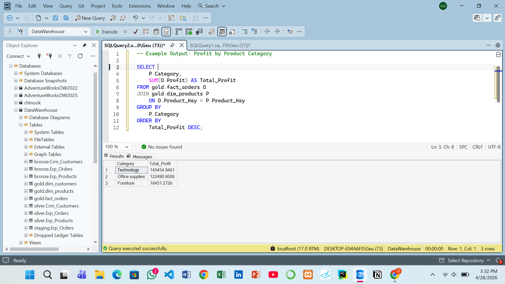

# Supply Chain Data Warehouse & Analytics for Resource Distribution (SQL Server Project)

## Project Overview

This project demonstrates an end-to-end **Data Warehouse and Analytics solution** built using SQL Server.

It models a real-world **supply chain and resource distribution system**, transforming raw transactional data into a structured analytical warehouse that supports **data-driven decision-making in logistics, demand planning, and efficiency optimization**.

The system follows a **Medallion Architecture (Bronze → Silver → Gold)** and implements a **Star Schema data model with surrogate keys, KPI analytics, and BI-ready views**.

---

## Project Highlights

- Built a full **Medallion Data Warehouse (Bronze → Silver → Gold)**
- Designed a **Star Schema with Fact & Dimension tables**
- Created a **KPI framework mapped to business questions**
- Developed a **scalable analytics roadmap (SQL → BI → ML)**
- Structured project into **Data Engineering + Data Science layers**

This project demonstrates the full pipeline:
**Raw Data → Clean Data → Analytics → Predictions**

---

## Why This Project Matters

This project demonstrates how raw operational data can be transformed into a structured analytics system that supports real-world decision-making.

It reflects real industry practices used in:
- Supply chain systems  
- E-commerce analytics  
- Humanitarian logistics platforms  

---

## Project Objectives

- Design and implement a scalable data warehouse using SQL Server  
- Clean, transform, and structure raw supply chain data  
- Build a **Star Schema (Fact & Dimension model)**  
- Implement **Surrogate Keys for optimized relational integrity**  
- Develop a **KPI Analytical Layer for business insights**  
- Create **BI-ready views for reporting tools (Power BI)**  
- Support decision-making in **resource distribution and logistics**  

---

## Data Architecture
 

[View Data Warehouse Layers](Docs/data_warehouse_layers.png)

### Data Flow

Source Data → Bronze Layer → Silver Layer → Gold Layer → Analytics & BI

[View Data Warehouse Design](Docs/data_warehouse_design.drawio.png)

### Layer Description

- **Bronze Layer**  
  Raw ingested data from source systems with no transformations.

- **Silver Layer**  
  Cleaned and standardized data.  
  Data quality issues such as duplicates and inconsistencies are resolved.

- **Gold Layer**  
  Business-ready data modeled using a Star Schema (Fact & Dimension tables) optimized for analytics and reporting.

> Note: While the Silver layer can be queried for validation and intermediate analysis, the **Gold layer serves as the single source of truth for reporting and analytics**.

---

## Data Model (Gold Layer - Star Schema)

[View Star Schema](Docs/star_schema.drawio.png) 

### Fact Table

**fact_orders**
- Order_ID  
- Order_Date  
- Ship_Date  
- Ship_Mode  
- Sales  
- Quantity  
- Discount  
- Profit  
- Customer_Key (FK)  
- Product_Key (FK)  

---

### Dimension Tables

**dim_customers**
- Customer_Key (PK - Surrogate Key)  
- Customer_ID (Business Key)  
- Customer_Name  
- Region  
- Segment  

**dim_products**
- Product_Key (PK - Surrogate Key)  
- Product_ID (Business Key)  
- Product_Name  
- Category  
- Sub_Category  

---

## Data Dictionary (Summary)

[View Data Dictionary](Docs/data_dictionary.md)

### fact_orders
- Sales → Revenue per transaction  
- Quantity → Number of items sold  
- Discount → Discount applied  
- Profit → Profit or loss (can be negative)  

### dim_customers
- Segment → Consumer, Corporate, Home Office  
- Region → Geographic classification  

### dim_products
- Category → High-level grouping  
- Sub_Category → Detailed product classification  

---

## Key Design Features

- Star Schema architecture for analytical efficiency  
- Surrogate Keys for improved scalability and join performance  
- Separation of Fact and Dimension tables  
- Separation of storage (Silver) and analytics (Gold)  
- Fully structured Gold layer for analytics  
- Reusable BI-ready views  

---

## Performance Optimization

Indexes implemented on Fact table:

- Customer_Key  
- Product_Key  

These indexes improve:
- Join performance between Fact and Dimensions  
- KPI query execution speed  
- Dashboard responsiveness  

### Project Integration: Current State vs Roadmap

- **Project 1 (Data Warehouse)**  
  Fully implemented, operational and serves as the foundation for project 2.  
  It provides structured, clean, and analytics-ready data using a Medallion Architecture and Star Schema design.

---

**Example Output: Monthly Sales Trend**

This query answers **KPI 1a: Monthly/Yearly Sales Trends**, showing how revenue evolves over time.

---

**Example Output: Profit by Product Category**

This query answers **KPI 1d: Product categories contributing most to profit**, helping identify high-performing categories.
  

---

## Tools & Technologies

- SQL Server (T-SQL)  
- Python  
- Data Warehousing (Star Schema Design)  
- Surrogate Key Modeling  
- SQL Indexing & Optimization  
- Power BI  
- Git & GitHub  

---

## Data Engineering Process

1. Data Acquisition (Global Superstore dataset)  
2. Data Splitting (Customers, Orders, Products)  
3. Data Cleaning (Silver Layer)  
4. Data Modeling (Gold Layer)  
5. Performance Optimization (Indexing)  
6. Analytics Layer (KPI queries)  
7. Reporting Layer (Views for BI tools)  

---

## Real-World & Humanitarian Application

This project simulates real-world **supply chain and humanitarian logistics systems**, applicable to:

- Resource distribution tracking  
- Humanitarian aid delivery  
- Monitoring & Evaluation (M&E)  
- NGO and UN logistics operations  
- Public sector planning  

---

## Key Skills Demonstrated

- Data Warehouse Design & Architecture  
- ETL Pipeline Development  
- Star Schema Modeling  
- Surrogate Key Implementation  
- SQL Performance Optimization  
- KPI Development & Analytics  
- BI-Ready Data Modeling  

---

## Future Improvements

- Incremental loading (ETL automation)  
- Slowly Changing Dimensions (SCD Type 2)  
- Power BI dashboard implementation  
- Data quality monitoring  
- Cloud migration (Azure/AWS)  

---

## Author
Geu Kuei

Mathematics Educator | Public Health & Education Data | 
ALX Data Engineering Fellow

## License
This project is licensed under the MIT License. You are free to use, modify, and share this project with proper attribution.

